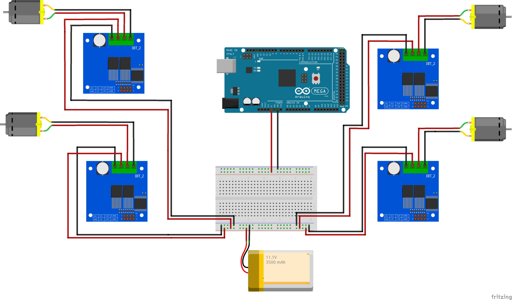

# Arduino Wheeled Robot

## Build a Simple Arduino 4 Wheeled Robot 

This Repo contains the Code, 3D Prints and Schematic to Build your own Simple Arduino Robot. Inspired by Droiid Package Delivery Robot.

Feel free to contribute to the Repo. More info on: [smartbuilds.io](https://smartbuilds.io)

# Part List:

Motor Parts 
- Battery LiPo 11.1V, 3500 mAh 
- 4 x 12V DC Geared Motor x6 (High Torque 300 RPM)
- 4 x BTS7960b Motor Driver
- Arduino Mega

Hardware / Chassis
- Wheels (Stroller Wheels)
- Chassis (3D printed Files) - provided in repo
- M3 Screws

Sensors (optional)
- Bluetooth (HC-05)
- Ultrasonic Sensors x 2

*Note:* If you do not have a 3D printer, alternativelly consider a pre-built chassis or creating your own. 

This Robot uses 4 x [BTS7960b Motor Driver](https://www.handsontec.com/dataspecs/module/BTS7960%20Motor%20Driver.pdf)

| Pin No  | Function | Description |
|---|---|---|
|1 |RPWM| Forward Level or PWM signal, Active High |
|2 |LPWM |Reverse Level or PWM signal, Active High |
|3 |R_EN |Forward Drive Enable Input, Active High/ Low Disable|
|4 |L_EN | Reverse Drive Enable Input, Active High/Low Disable|
|5 | R_IS | Forward Drive, Side current alarm output |
|6 | L_IS| Reverse Drive, Side current alarm output |
|7 | Vcc| +5V Power Supply microcontroller |
|8 |Gnd| Ground Power Supply microcontroller|

## Robot Control Pins

Each Motor is represented by X_L1, where RPWM_L1 means is connected on Pin 3.
View the Code for the Pin Wiring. 

Motor Driver Control Pins - Left Motor 1
- RPWM_L1 3 // define pin 3 for RPWM pin (output)
- R_EN_L1 11 // define pin 2 for R_EN pin (input)
- R_IS_L1 10 // define pin 5 for R_IS pin (output)
- LPWM_L1 2 // define pin 6 for LPWM pin (output)
- L_EN_L1 12 // define pin 7 for L_EN pin (input)
- L_IS_L1 13 // define pin 8 for L_IS pin (output)

## Block Diagram

*Note:* The Block Diagram dosen't show thew Control Pins (Refer to above)

